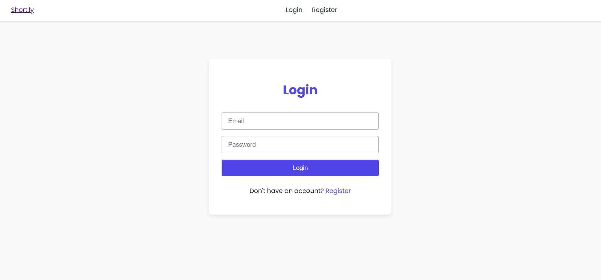
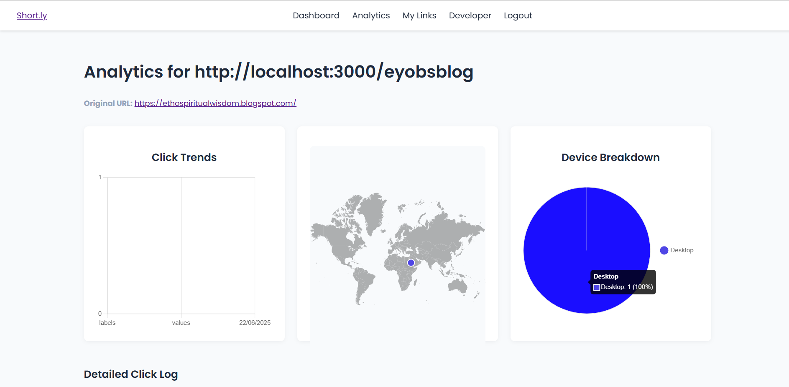

  
   
   
  
  # **Short.ly: A Backend-Focused URL Shortener**
  
  **A full-stack application built to demonstrate robust, secure, and scalable backend architecture for the CodeAlpha internship.**
  
   
  
  
  
  

---

<a href="https://short-ly-6oe6.onrender.com">
   <h3>Live demo</h3>
  </a>

### **🧠 Backend Architecture & Design Philosophy**
While the application features a clean UI, its core is a powerful backend architecture designed for efficiency and security. This project is a testament to a deep understanding of server-side principles:

-   **Secure by Design**: APIs are protected with authentication middleware. Routes that expose user data are locked down, ensuring that users can only access their own information.
-   **Efficient Data Modeling**: The MongoDB schema is logically structured using Mongoose, enabling fast queries for users, URLs, and complex, time-series analytics data.
-   **Robust Authentication**: Security is paramount. The system uses session-based authentication and hashes all user passwords with `bcryptjs`, leaving no plain-text credentials in the database.
-   **Production-Ready Configuration**: The app is fully configured with environment variables (`.env`), allowing for seamless and secure deployment to production environments like Render without any code changes.
-   **Modular & Scalable Code**: The backend codebase is organized into modular routers, controllers, and models, making it clean, easy to maintain, and scalable for future features.

---

### **✨ Key Features**

| Feature | Description |
| :--- | :--- |
| ✅ **User Authentication** | Secure, session-based registration and login system. |
| 🔗 **Powerful Shortening** | Instantly generate unique, short links with an option for custom aliases. |
| 📈 **Advanced Analytics** | Private dashboard for each link with charts for click trends and device types. |
| 🌍 **Geographic Tracking** | An interactive world map that visualizes the origin of every click. |
| 📂 **Link Management** | A central "My Links" page to view, copy, and access analytics for all created URLs. |
| 😎 **Developer Showcase** | A custom-built developer profile page with a unique, animated design. |

---

### **📸 Screenshot Gallery**

<table>
  <tr>
    <td align="center"><strong>Regsteration & Login</strong></td>
    <td align="center"><strong>Dashboard </strong></td>
    <td align="center"><strong>Detailed Analytics</strong></td>
  </tr>
  <tr>
    <td></td>
    <td></td>
    <td></td>
  </tr>
</table>

---

### **🛠️ Technologies & Tools**

| Category | Tools |
| :--- | :--- |
| **Backend** |   |
| **Database** |   |
| **Frontend** |    |
| **Authentication** |   |
| **Charting** |  |

---

This project was a fantastic learning experience that covered every aspect of modern web development. It stands as a practical demonstration of the backend development skills and architectural concepts central to the CodeAlpha internship program. 
